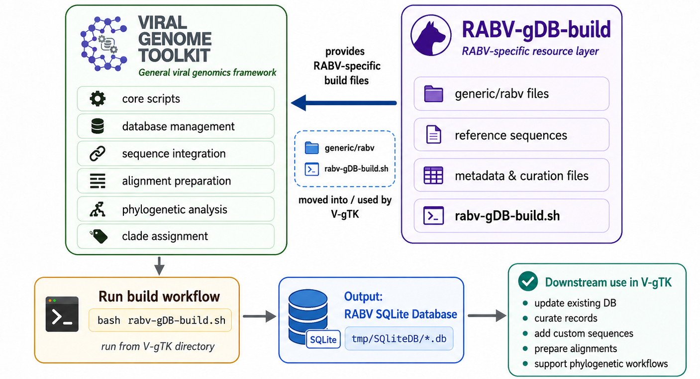

#### (scripts and repo under development, any bugs, please report)
# V-gTK
V-gTK is a bioinformatics framework designed to support viral genomic analysis through a structured, reproducible, and modular workflow. The framework provides tools for managing viral genome datasets, preparing sequence alignments, integrating custom sequences with reference databases, and supporting downstream phylogenetic and clade-assignment analyses. V-gTK is developed with a focus on supporting both segnemted and non-segmented virus. By combining database-driven sequence handling, automated alignment preparation, metadata integration, and tree-based analysis support, V-gTK aims to simplify complex genomic workflows and improve consistency across analyses.

The detailed document can be found [here](https://centre-for-virus-research.github.io/V-gTK/)

## Installation
Install Conda using one of the following options: Miniconda, Miniforge, or Anaconda.
After installation, create the V-gTK environment using the provided environment.yml file:

```shell
conda env create --file environment.yml
```

Once the environment is created, activate it using:

```shell
conda activate vgtk
```

## Working with a Real-Time RABV Example

This section demonstrates the execution of a fully functional RABV example workflow using V-gTK. The example shows how V-gTK can be used to build a rabies virus genomic database, organise RABV-specific reference files, generate a local SQLite database, and prepare the database for downstream genomic analysis. 

The RABV workflow is organised inside the `rabv-gdb_build` repo and provides the files, scripts and pipelines required to construct a database from curated RABV reference sequences.

Once the RABV database has been created, the same database can be maintained, updated, curated, and modified as required. V-gTK provides a set of easy-to-use scripts that allow users to manage the database without needing to rebuild the entire workflow from the beginning each time.

These scripts support routine database maintenance tasks such as adding new RABV sequences, updating existing metadata, correcting sequence records, modifying clade or lineage annotations, and removing or replacing outdated entries. This makes the database suitable for real-time genomic surveillance, where new sequences and updated information may need to be incorporated regularly.

The framework is designed to keep the database flexible and reusable. Users can curate the reference dataset as new information becomes available, apply manual corrections where needed, and regenerate analysis-ready files for downstream workflows. By providing dedicated scripts for database updates and curation, V-gTK helps ensure that the RABV genomic database remains consistent, reproducible, and up to date.

In this way, V-gTK separates the initial database-building step from the ongoing database management process. After the first build, users can continue to refine and extend the same database through simple scripted operations, making it easier to support long-term virus specific genomic analysis and surveillance.



### Existing RABV specific input files

Before running the database build workflow, the required input files should be available inside `rabv-gdb_build`. These may include:

- curated RABV reference accessions
- reference tree with meta data
- clade, lineage, or designation files
- configuration files used by the database-building scripts

These files are used to link each sequence with its corresponding metadata and classification information. The database-building scripts then organise the input data into a structured local database that can be used by the rest of the V-gTK framework.

## Building the RABV database

Building the RABV database using V-gTK is a straightforward process. The workflow is designed so that users can prepare the required RABV-specific files, run a single build script, and generate a local SQLite database that can be used for downstream V-gTK analyses.

The following steps describe how to prepare and run V-gTK to generate the RABV genomic database.

### 1. Clone the V-gTK repository

First, clone the V-gTK repository and move into the project directory.

```shell
git clone https://github.com/centre-for-virus-research/V-gTK
cd V-gTK
```

### 2. Clone the RABV-gDB-build repository
The RABV-gDB-build repository contains additional files and scripts that are specific to building the rabies virus genomic database.
From inside the V-gTK directory, clone the RABV-gDB-build repository:

```shell
git clone https://github.com/RAGE-toolkit/RABV-gDB-build
```

After cloning, the RABV-gDB-build directory will contain RABV-specific input files, configuration files, and the database build script required for generating the RABV database.
### 3. Move the RABV-Specific files into the V-gTK directory
Next, move the required files from RABV-gDB-build into the main V-gTK directory.
```shell
mv RABV-gDB-build/generic .
mv RABV-gDB-build/rabv-gDB-build.sh .
```

After this step, the main V-gTK directory should contain the generic directory and the rabv_gDB-build.sh script.
Your V-gTK directory should now look similar to the example shown below:

```text
V-gTK/
├── generic/
│   ├── RABV
│         ├── references/
│         ├─ curation/
│         ├ curation/
│         └── tree/
│          ........
├── rabv_gDB-build.sh
├── environment.yml
├── README.md
├── LICENSE
└── ....
```

### 4. Run the RABV database build script
Once the required files are in place, run the build script from inside the V-gTK directory:
```shell
bash rabv_gDB-build.sh
```
This script will process the RABV-specific input files, organise the sequence and metadata information, and generate a local SQLite database.

### 5. Output database
After the build process completes successfully, the generated SQLite database will be available inside the following directory:
tmp/SqliteDB/
The resulting database can be opened and inspected using DB Browser for SQLite:
https://sqlitebrowser.org
This allows users to view the database tables, inspect sequence records, check metadata fields, and confirm that the RABV database has been generated correctly.

### 6. Using the generated database
Once created, the RABV database can be used by V-gTK for downstream analysis tasks, including sequence management, custom sequence addition, metadata curation, alignment preparation, and phylogenetic or clade-assignment workflows.
The same database can also be updated and curated later using the available V-gTK scripts, allowing users to maintain a flexible and reusable RABV genomic database without rebuilding the entire workflow from scratch.


## Updating the Existing Database

Once the RABV database has been generated using the build script, updating the existing database is a straightforward process. Instead of creating a completely new database from the beginning, V-gTK allows users to update an already generated SQLite database by providing the existing database file path and enabling the update option in the bash script.

To update an existing database, open the RABV database build script and modify the database update parameters. In the example below, the required changes are made to the `db_file` and `is_update` variables.

```shell
# parameters
TAX_ID=${1:-11292} # RABV

scripts_dir="$(dirname "$0")/scripts"
generic_dir="$(dirname "$0")/generic/rabv"
db_name="rabv-jul0425"

db_file="tmp/SqliteDB/yourDB.db"      # set this if updating an existing db, e.g. "rabv-gDB_Dec022025.db"
is_update=0                          # 1 for update and 0 for not update

```
To enable database updating, set the db_file variable to the path of the existing SQLite database that you want to update. Then change is_update=0 to is_update=1

For Example:
```shell
db_file="tmp/SqliteDB/rabv-gDB_Dec022025.db"
is_update=1
```
Here, db_file points to the existing RABV database, and is_update=1 tells the script to run in update mode.
After making these changes, run the bash script again:

After making these changes, run the bash script again:

```shell
bash rabv_gDB-build.sh
```
